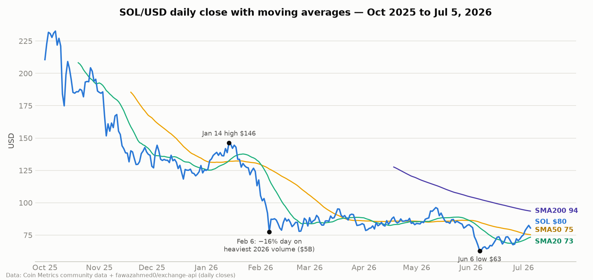
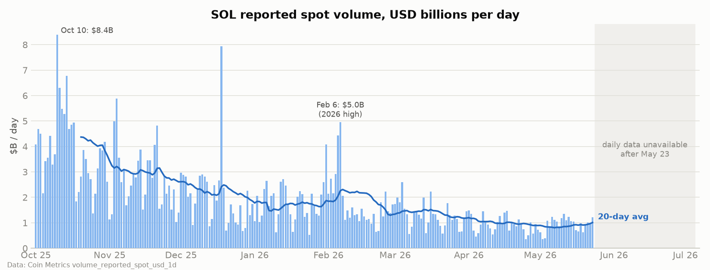
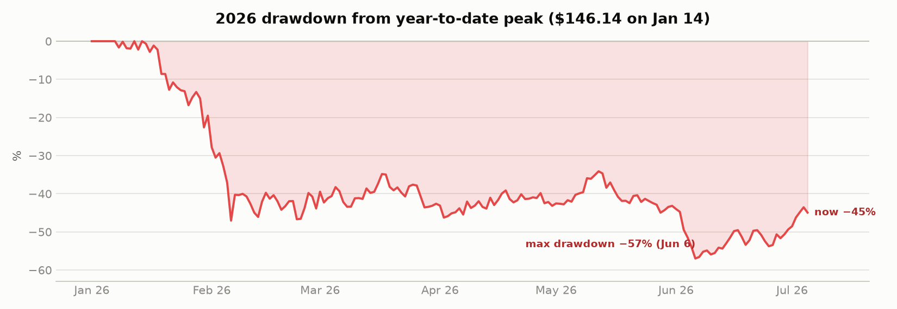
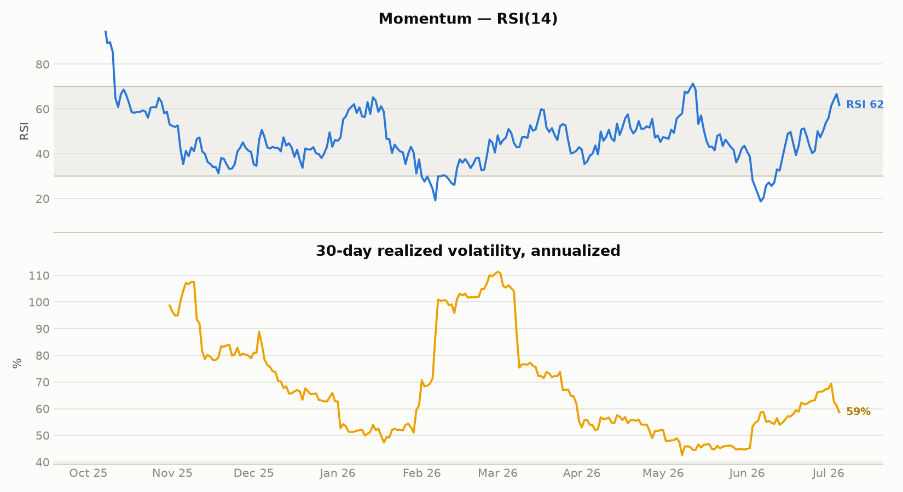
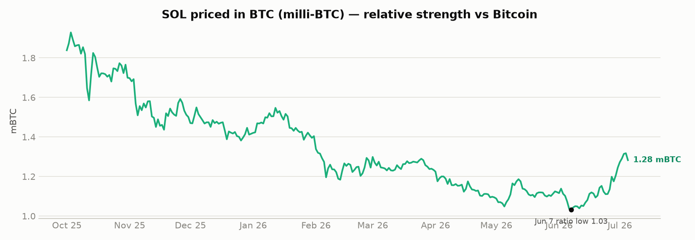
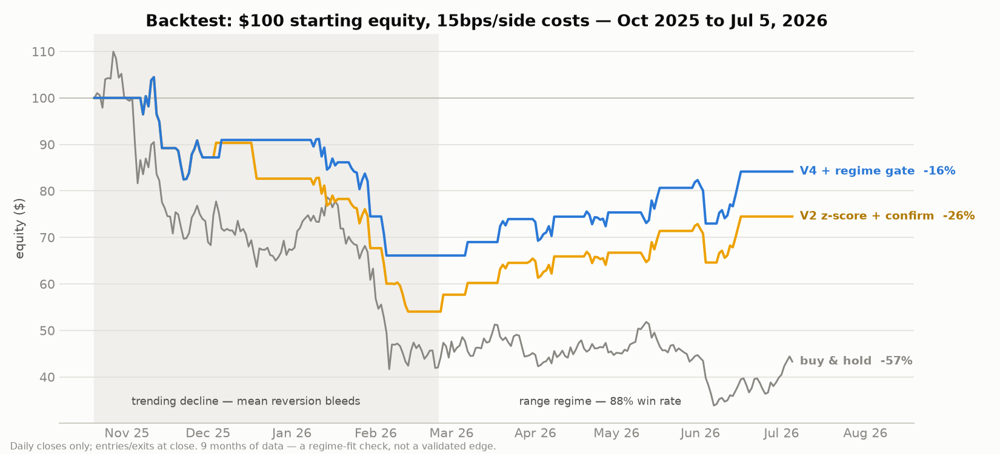

# Solana (SOL) — 2026 Price & Volume Analysis

*Prepared July 5, 2026 · Spot reference ≈ **$80.45***

> **Not financial advice.** This is a data analysis to support your own decision-making. Crypto
> is extremely volatile — SOL has averaged a **3.5% daily standard deviation** in 2026, with 24
> days moving more than ±5%. Size positions accordingly.

---

## TL;DR

- **SOL is down 35.6% YTD** ($124.99 → $80.45) after a maximum drawdown of **−57%** from the
  January 14 high of $146.14 to the June 6 low of $62.88. It sits **−73% below the January 2025
  all-time high (~$295)**.
- **The current move is a recovery, not yet a trend change**: +28% off the June low, price back
  above the 20- and 50-day SMAs, RSI 62, fresh MACD bullish cross — but still **14% below the
  200-day SMA** ($93.5), and the 20/50 SMA pair remains death-crossed since June 1.
- **Volume tells a caution story**: average daily reported spot volume has fallen every month —
  $2.9B/day in Q4 2025 → $1.80B (Jan) → $0.94B (May). Sell-offs get the volume (Feb 6: $5.0B on
  a −15.8% day); rallies so far haven't. Participation is thinning, which cuts both ways for an
  active trader: cleaner technical levels, but nastier slippage on shock days.
- **Relative strength turned**: SOL/BTC bottomed June 7 at 1.03 mBTC and is +24% since — the June
  recovery is SOL *outperforming* BTC, not just beta.
- **Key upcoming catalyst**: the Alpenglow consensus upgrade targeted for **Q3 2026** (~100×
  faster finality). Firedancer has been live since December 2025. Tokenized-stock volume on
  Solana is breaking records ($4.9B in H1). Bear case: the memecoin engine that drove 2024–25 is
  gone (DEX volume −62% in February alone) and ETF inflows keep decelerating.

---

## 1. Data & methodology

| Series | Source | Coverage |
|---|---|---|
| Daily close (USD), SOL/BTC | [Coin Metrics community data](https://github.com/coinmetrics/data) + [fawazahmed0/exchange-api](https://github.com/fawazahmed0/exchange-api) daily snapshots | Oct 1, 2025 → Jul 5, 2026 |
| Daily reported spot volume (USD) | Coin Metrics `volume_reported_spot_usd_1d` | Oct 1, 2025 → May 23, 2026 |
| June–July volume, events, catalysts | Web sources (linked in §6) | spot checks |

Notes: closes are daily snapshots, not exchange OHLC — intraday highs/lows (e.g. the ~$61 June 6
wick) are slightly wider than shown. One corrupted upstream SOL/BTC rate (Dec 6, 2025) was
interpolated; one missing day (Dec 10, 2025) forward-filled. Daily volume after May 23 wasn't
available from a free machine-readable source at time of writing; recent 24h prints from
CoinGecko/CoinMarketCap run **$2–4B/day**. Reproduce with `analysis.py` + `data/sol_daily.csv`.

## 2. How 2026 has traded, month by month

| Month | Open | Close | High | Low | Return | Avg vol/day |
|---|---|---|---|---|---|---|
| Jan | 124.99 | 117.61 | **146.14** (Jan 14) | 113.11 | −5.9% | $1.80B |
| Feb | 105.50 | 82.03 | 105.50 | 77.39 | **−22.3%** | $1.75B |
| Mar | 88.47 | 83.85 | 95.24 | 82.45 | −5.2% | $1.30B |
| Apr | 83.15 | 83.06 | 88.95 (Apr 18) | 78.56 | −0.1% | $0.92B |
| May | 83.97 | 83.05 | 96.28 (May 12) | 80.43 | −1.1% | $0.94B |
| Jun | 81.84 | 74.01 | 81.84 | **62.88** (Jun 6) | −9.6% | n/a |
| Jul (MTD) | 75.22 | 80.45 | 82.50 | 75.22 | **+7.0%** | n/a |

**The narrative behind the numbers:**

- **January — the top and the cascade.** SOL entered the year at $125 (already down from
  $232 in early October 2025) and rallied to $146.14 by January 14. Crowded long positioning met
  a macro shock — the Bank of Japan's December rate hike to 0.75% and the risk-off turn it
  triggered — and on January 20 roughly $390M of crypto positions were liquidated ($348M longs),
  knocking SOL to the $128 area.
- **February — the engine broke.** Solana DEX volume collapsed from ~$118B to ~$44B in a month
  (−62%) as the memecoin economy unwound. Feb 6 was the year's worst day (**−15.8%**) on the
  year's biggest volume (**$5.0B**); Feb 7 bounced **+12.8%** — a classic capitulation signature,
  but the month still closed −22.3%.
- **March–May — the floor-building range.** Three months of sideways chop between roughly $78
  and $96, with failing rallies (Apr 18: $89, May 12: $96) and steadily *falling* volume. The
  20/50-day SMA pair whipsawed six times in six months — trend-following was expensive in this
  regime; range/mean-reversion tactics worked better.
- **June — capitulation #2.** Bitcoin's slide toward $60k and record BTC ETF outflows (~$6.4B)
  dragged SOL to a multi-year low of $62.88 (June 6, intraday ~$61), −24% in a week. The June 6
  session whipsawed >8% three separate times — thin-liquidity behavior.
- **Late June–July — the turn.** Higher lows since June 6, +28% off the bottom, back over $80,
  and — importantly — outperforming BTC on the way up.

## 3. Volume analysis

- **Participation is in a persistent downtrend**: Q4-25 averaged $2.89B/day; 2026 has averaged
  $1.36B/day (median $1.22B), decaying every month through May.
- **Volume follows fear, not greed**: correlation between volume and |daily return| is **0.47**,
  and the year's biggest volume days are all sell-off days (Feb 6: $4.96B). Average volume on
  down days ($1.39B) modestly exceeds up days ($1.33B). The recovery off the June low has *not*
  yet shown a confirming volume expansion in the data available — treat the rally as unconfirmed
  until turnover picks up.
- **What this means for active trading**: (1) breakouts on sub-$1B tape are suspect — demand
  volume confirmation before chasing; (2) shock days can 4–5× average volume with double-digit
  moves, so resting stops get swept — prefer alerts + manual execution or wider stops with
  smaller size; (3) thinner books amplify weekend/off-hours moves.

## 4. Technical picture (as of July 5)

| Indicator | Value | Read |
|---|---|---|
| Price vs SMA20 ($73.3) | +9.7% | short-term uptrend |
| Price vs SMA50 ($75.3) | +6.8% | reclaimed |
| Price vs SMA100 ($80.5) | ±0.0% | **testing right now** |
| Price vs SMA200 ($93.5) | −14.0% | primary trend still down |
| SMA20/50 | death-crossed since Jun 1, converging | golden cross likely within days if price holds |
| RSI(14) | 61.7 | bullish momentum, not yet overbought |
| MACD | +1.67 vs signal +0.09 | fresh bullish cross |
| Bollinger (20,2) | price at upper band ($81.9) | extended short-term; consolidation/pullback common here |
| 30-day realized vol | 59% annualized | cooling from the 111% Feb–Mar peak, but re-rising off June |
| SOL/BTC | 1.28 mBTC, +24% off Jun 7 low | relative strength confirming |

**Levels that have mattered repeatedly this year** (close-based):

- **Resistance**: **$80.5–82.5** (SMA100 + July high — the current battle), **$85–87** (May
  congestion), **$89–90** (April high), **$96** (May high — the big one; above it the Feb gap
  toward $105 opens).
- **Support**: **$77** (February low / June breakdown shelf — widely watched flip level),
  **$73–75** (SMA20/50 + late-June pivot cluster), **$67–70** (June consolidation), **$62.9**
  (the June low — line in the sand; below it there's little structure until the high-$50s).

## 5. Catalysts & risks for H2 2026

**Bullish:**
- **Alpenglow mainnet targeted Q3 2026** (Q4 fallback) — Solana's largest-ever consensus
  overhaul, cutting finality from ~12.8s to ~100–150ms. Classic buy-the-rumor setup with
  event-risk on delays.
- **Firedancer live since Dec 2025** (>20% of validators) — client diversity/reliability story
  for institutions.
- **Tokenized equities are a genuinely new demand driver**: $4.9B H1-2026 volume (6× H2-2025),
  ~95% chain market share, record $553M single day (Jun 24).
- **Network usage at all-time highs** despite price: record 25.3B transactions in Q1, ATH
  stablecoin supply and active addresses — a widening gap between usage and price.
- ETF complex still net-accumulating: ~$1.1B cumulative inflows by mid-June (BSOL ~$889M).

**Bearish:**
- **ETF inflows decelerating for six+ months** ($419M Nov → $63M Feb monthly pace) and flows lag
  sell-offs rather than cushioning them.
- **The memecoin engine is gone** and nothing on-chain has replaced its fee/volume contribution
  at scale yet; spot volume keeps shrinking.
- **Macro is the market**: both 2026 capitulations were macro-triggered (BoJ tightening; BTC ETF
  outflows). SOL is a high-beta expression of BTC direction — a BTC break below $60k almost
  certainly sends SOL back to retest $63.
- Structurally: still −73% from ATH with heavy overhead supply from every 2025 buyer.

## 6. If you're going to trade it actively — a framework

*Scenario map, not advice:*

1. **Continuation**: daily close above **$82.5** (July high) on expanding volume → targets
   $85–87, then $89–90. RSI has room before overbought; the golden cross would add followers.
2. **Rejection here** (most common outcome at an upper Bollinger + SMA100 test after a +28%
   run): pullback to **$73–75**. Higher-low holds above the June trendline keep the recovery
   structure intact — that's the reload zone the structure favors.
3. **Breakdown**: lose **$73** on volume → $67–70 fast, and the $62.9 June low becomes live
   again. Below $63, exit-first-ask-questions-later; there is no 2026 support beneath it.
4. **Risk math**: with 3.5% daily σ and 13% of days moving >5%, a stop tighter than ~7–8% on a
   swing position is noise; if that stop distance is too expensive, the position is too big.
   Realized vol at 59% means options (where you trade them) are pricing swings roughly in line
   with recent reality — neither cheap nor rich.
5. **Mark the calendar**: Alpenglow testnet/mainnet announcements are the schedulable vol events
   of H2. BoJ meetings and BTC ETF flow prints remain the unscheduled ones.

## 7. Backtest: z-score mean reversion (added after §6)

`backtest.py` tests the §6 framework against this dataset (Oct 20, 2025 – Jul 5, 2026,
daily closes, 15bps/side costs). Headline results:

| Variant | Total | Max DD | Trades | Win% |
|---|---|---|---|---|
| Buy & hold | −56.7% | −69.2% | — | — |
| V1 raw z-score, long/short | −29.1% | −35.2% | 22 | 41% |
| V2 + confirmation-day entry | −25.5% | −48.3% | 16 | 50% |
| V4 + SMA50-slope regime gate | **−15.8%** | −36.7% | 13 | 54% |

The decisive finding is the **regime split** of the identical V2 rules:

- Oct 20 – Feb 23 (trending decline): 8 trades, **12% win rate, −57.7% cumulative**
- Feb 24 – Jul 5 (range regime): 8 trades, **88% win rate, +34.7% cumulative**

Conclusions: (1) every variant beats buy-and-hold, but none is profitable across the full
period — the strategy is only tradeable *with* a working regime filter; (2) the simple
ex-ante slope gate recovers part of that (V4), and the residual losers (Jan 22, Feb 3,
May 29) were all macro-shock knives that price-based gates catch too late — which is the
specific job of the AI news/macro veto described in [EXECUTION.md](EXECUTION.md);
(3) sensitivity: stricter entries (z=2.0) lose less in the downtrend; results degrade
roughly linearly with costs (see the sensitivity grid in `backtest.py` output).
**Caveats**: 9 months of daily closes, 13–22 trades — a regime-fit sanity check, not a
validated edge; intraday fills/stops are approximated at next close; the funding-rate
gate could not be backtested (no free historical funding source) and is live-only logic.

## Sources

- Price/volume: [Coin Metrics community data](https://github.com/coinmetrics/data), [fawazahmed0/exchange-api](https://github.com/fawazahmed0/exchange-api)
- [Phemex — Solana 2026 outlook: memecoin crash & Alpenglow](https://phemex.com/blogs/solana-memecoin-crash-2026)
- [MEXC — Why is Solana dropping](https://www.mexc.com/learn/article/why-is-solana-dropping-key-factors-behind-the-price-decline/1) · [Crypto crash 2026: SOL after 67% plunge](https://blog.mexc.com/news/is-solana-a-buy-after-price-plunge/)
- [Startup Fortune — Solana's crash tells half the story](https://startupfortune.com/solanas-price-crash-to-multi-year-lows-tells-only-half-the-story-of-what-the-network-is-actually-doing/)
- [Capital.com — SOL ETF inflows lag sell-off (Jun 9)](https://capital.com/en-int/market-updates/solana-price-prediction-09-06-2026)
- [AInvest — Solana ETFs attract $1.5B despite drop](https://www.ainvest.com/news/solana-etfs-attract-1-5-billion-inflows-57-token-price-drop-2603/) · [TipRanks — SSK staking ETF flows](https://www.tipranks.com/news/cryptocurrencies/solana-staking-etf-lures-new-money-even-as-token-price-slides)
- [StakePoint — Solana 2026 roadmap: Alpenglow, Firedancer](https://stakepoint.app/blog/solana-2026-roadmap-breakdown) · [Solana Compass — Alpenglow](https://solanacompass.com/learn/Lightspeed/alpenglow-solanas-largest-protocol-upgrade-ever-brennan-watt-anza) · [MEXC — Firedancer mainnet](https://www.mexc.com/learn/article/solana-firedancer-explained-mainnet-launch-1m-tps-target-and-what-comes-next/1)
- [CryptoBriefing — tokenized stocks $4.9B H1](https://cryptobriefing.com/solana-tokenized-stocks-volume-surges-h1-2026/) · [CryptoRank — 95% tokenized-stock share](https://cryptorank.io/news/feed/9b625-solana-captures-95-of-tokenized-stock-trading-as-weekly-volume-hits-record)
- [Motley Fool — SOL fell 13% in 30 days (Jul 2)](https://www.fool.com/investing/2026/07/02/solana-fell-13-in-30-days-history-suggests-relief/)
- [CoinGabbar — July 2026 prediction, $77 flip](https://www.coingabbar.com/en/price-prediction/solana-price-prediction-july-2026)
